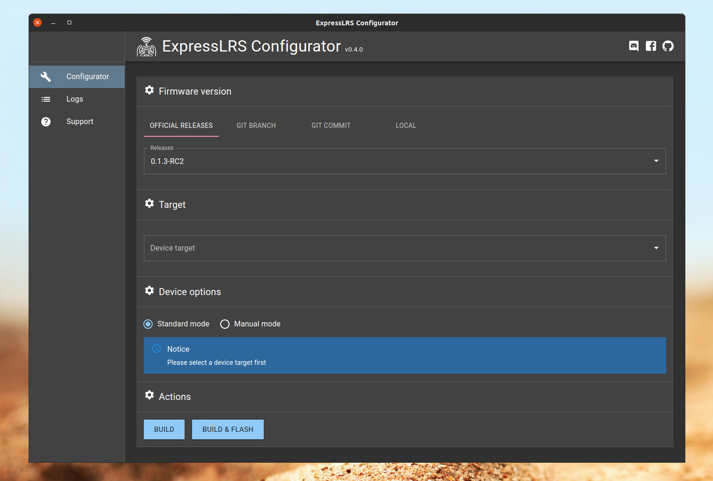
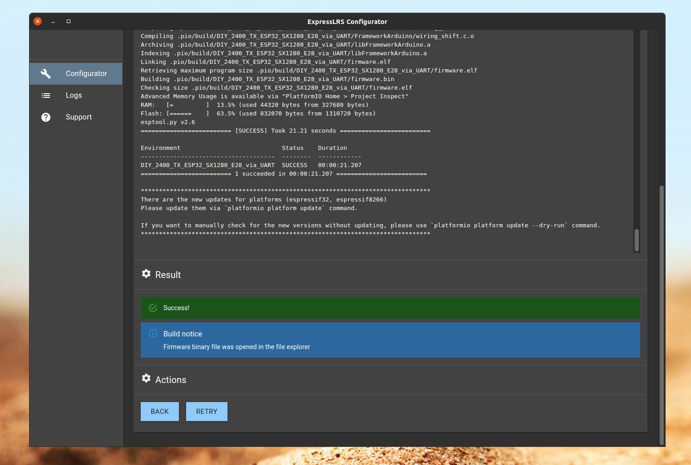

# ExpressLRS Configurator

[](https://github.com/ExpressLRS/ExpressLRS-Configurator/releases)
[](https://github.com/ExpressLRS/ExpressLRS-Configurator/blob/master/LICENSE)
[](http://discord.gg/dS6ReFY)
[](https://opencollective.com/expresslrs)

ExpressLRS Configurator is a cross-platform build & configuration tool for the
[ExpressLRS](https://github.com/ExpressLRS/ExpressLRS) - open source RC link for RC applications.

## Need help? Confused? Join the Community!

- [Discord Chat](https://discord.gg/dS6ReFY)
- [Facebook Group](https://www.facebook.com/groups/636441730280366)
- [Documentation](https://www.expresslrs.org/)

## Support ExpressLRS

Supporting ExpressLRS is as easy as contributing a feature, either code or just a fleshed out idea. Coding not your
thing? Testing a Pull Request using the convenient Configurator tab and providing feedback is essential as well. We're
all working together.

If you don't have the time to contribute in that way, consider making a small donation. Donations are used to buy test
equipment, software licenses, and certificates needed to further the project and make it securely accessible. ExpressLRS
accepts donations through [Open Collective](https://opencollective.com/expresslrs), which provides recognition of donors
and transparency on how that support is utilized.

[](https://opencollective.com/expresslrs)

## Quick Start Guide

If you have hardware that you want to flash, please refer to our guides on the [website](https://www.expresslrs.org/),
and our [FAQ](https://www.expresslrs.org/3.0/faq/)

## Installation

We provide a standalone program for 64bit Windows, Linux and Mac.

Download the installer from [Releases](https://github.com/ExpressLRS/ExpressLRS-Configurator/releases) page.

### Notes

#### Windows

The minimum required version of windows is Windows 8.

#### macOS

Changes to the security model used in the latest versions of MacOS X 10.14 (Mojave) and 10.15 (Catalina)
mean that the operating system will show an error message ('"ExpressLRS Configurator.app" cannot be opened because the
developer cannot be verified') when trying to install the application.

To work around this, click `ExpressLRS Configurator.app` while pressing `control` key, and click `Open`. In the popup,
you'll be able to forcefully open the application. (you may need to try this twice.)

Alternatively, run the following command in a terminal after installing:

```
sudo xattr -rd com.apple.quarantine /Applications/ExpressLRS\ Configurator.app
```

#### Linux

Linux users have to install udev rules for PlatformIO supported boards/devices. The latest version of rules may be found
at https://raw.githubusercontent.com/platformio/platformio-core/master/platformio/assets/system/99-platformio-udev.rules

This file must be placed at `/etc/udev/rules.d/99-platformio-udev.rules` (preferred location) or
`/lib/udev/rules.d/99-platformio-udev.rules` (required on some broken systems).

Please open system Terminal and type:

```bash
# Recommended
curl -fsSL https://raw.githubusercontent.com/platformio/platformio-core/master/platformio/assets/system/99-platformio-udev.rules | sudo tee /etc/udev/rules.d/99-platformio-udev.rules

# OR, manually download and copy this file to destination folder
sudo cp 99-platformio-udev.rules /etc/udev/rules.d/99-platformio-udev.rules
```

Restart "udev" management tool:

```bash
sudo service udev restart
# or
sudo udevadm control --reload-rules
sudo udevadm trigger
```

Ubuntu/Debian users may need to add own "username" to the "dialout" group if they are not "root", doing this issuing:

```
sudo usermod -a -G dialout $USER
sudo usermod -a -G plugdev $USER
```

Similarly, Arch users may need to add their user to the “uucp” group

```bash
sudo usermod -a -G uucp $USER
sudo usermod -a -G lock $USER
```

##### Ubuntu 18.XX / Older Debian installs troubleshooting

On Ubuntu 18.XX you are not able to get recent git version by default, and some other system dependencies are missing.

Read more about this in [issue #26](https://github.com/ExpressLRS/ExpressLRS-Configurator/issues/26).

To work around that you can manually install required packages:

```
# install missing sys packages
sudo apt update
sudo apt-get install gconf2 gconf-service python3-distutils

# install git version >= 2.25
sudo add-apt-repository ppa:git-core/ppa
sudo apt update
sudo apt install git
```

## Localisation

**Please do not submit pull requests for translation changes, but read and follow the instructions below!**

ExpressLRS Configurator has been translated into several languages. The application will try to detect and use your
system language if a translation into this language is available.

If you prefer to have the application in English or any other language, you can select your desired language in the
"Settings" menu.

We want to make ExpressLRS accessible for pilots who are not fluent in English. We have got a team of volunteer
translators who do this work, but additional translators are always welcome to share the workload, and we are keen to
add additional languages. If you would like to help us with translations, you have got the following options:

- if you help by suggesting some updates or improvements to translations in a language you are familiar with, head
  to [crowdin.com](https://crowdin.com/project/expresslrs-configurator) and add your suggested translations there.
- if you would like to start working on the translation for a new language, or take on responsibility for proof-reading
  the translation for a language you are very familiar with, please head to the ExpressLRS Discord chat
  (registration [here](https://discord.gg/dS6ReFY)), and join the
  [#configurator-translation](https://discord.com/channels/596350022191415318/1121712995505021059) channel - the people
  in there can help you to get a new language added, or set you up as a proof reader.

Our localisation progress:


## Screenshots





## Architecture

```
 - - - - - - - - - - - - - - - - - - - -
|          ExpressLRS-Configurator      |
|                   |                   |
|     renderer      |        main       |
|                   |                   |
|   configurator <----->  api-server    |
|                   |          |        |
|                   |          V        |
|                   |      platformio   |
|_ _ _ _ _ _ _ _ _ _|_ _ _ _ _ | _ _ _ _|
                               V
                      ExpressLRS hardware
```

This Electron application is split into two parts: a local API server that does all the work, and a UI layer. Both of
these application layers communicate within each other using Graphql protocol.

Heavy use of TypeScript and `@graphql-codegen/cli` is made throughout the repository to ensure the datatypes transmitted
between the API and UI layers are consistent at compile-time and Graphql ensuring the datatypes are consistent at
runtime.

## Starting Development

Prerequisites

- node >=16.0
- git >= 2.25
- python >= 3.6
- platformio >= 5.0

Start the app in the dev environment:

```bash
yarn install --frozen-lockfile
yarn start
```

In order to simulate WI-FI devices on your local network you can start application with
`MULTICAST_DNS_SIMULATOR_ENABLED` environment variable:

```
npx cross-env MULTICAST_DNS_SIMULATOR_ENABLED=true yarn start
```

## Other useful cli commands

Generate TypeScript types from Graphql schema and Queries located in [src/ui/gql/queries](src/ui/gql/queries):

```bash
yarn run gql-codegen
```

## Legal disclaimer

The use and operation of this type of device may require a license, and some countries may forbid its use. It is
entirely up to the end user to ensure compliance with local regulations. This is experimental software / hardware and
there is no guarantee of stability or reliability. USE AT YOUR OWN RISK.

[](https://github.com/ExpressLRS/ExpressLRS/wiki#community)
