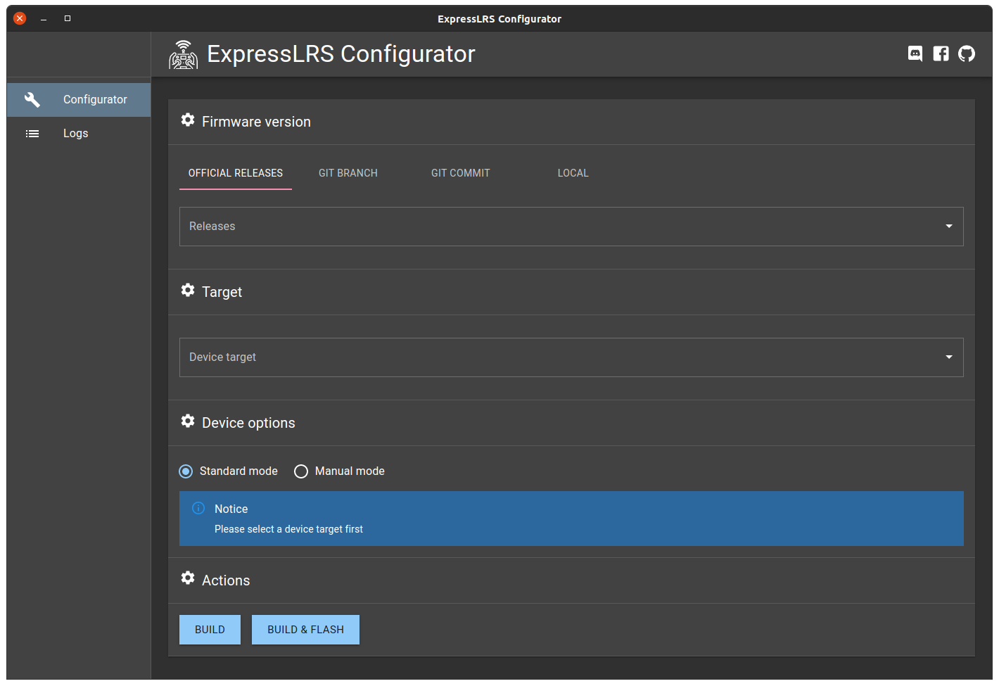

# ExpressLRS Configurator

ExpressLRS Configurator is a cross-platform build & configuration tool for the
[ExpressLRS](https://github.com/ExpressLRS/ExpressLRS) - open source RC link for RC applications.

## Need help? Confused? Join the Community!

- [Discord Chat](https://discord.gg/dS6ReFY)
- [Facebook Group](https://www.facebook.com/groups/636441730280366)

## Installation

We provide a standalone program for 64bit Windows, Linux and Mac.

Download the installer from [Releases](https://github.com/ExpressLRS/ExpressLRS-Configurator/releases) page.

### Notes

#### Windows

The minimum required version of windows is Windows 8.

#### macOS

Changes to the security model used in the latest versions of MacOS X 10.14 (Mojave) and 10.15 (Catalina)
mean that the operating system will show an error message ('"ExpressLRS Configurator.app" is damaged and can’t be
opened. You should move it to the Trash.') when trying to install the application. To work around this, run the
following command in a terminal after installing:

```
sudo xattr -rd com.apple.quarantine /Applications/ExpressLRS\ Configurator.app.
```

#### Linux

Linux users have to install udev rules for PlatformIO supported boards/devices. The latest version of rules may be found
at https://raw.githubusercontent.com/platformio/platformio-core/master/scripts/99-platformio-udev.rules

This file must be placed at `/etc/udev/rules.d/99-platformio-udev.rules` (preferred location) or
`/lib/udev/rules.d/99-platformio-udev.rules` (required on some broken systems).

Please open system Terminal and type:

```bash
# Recommended
curl -fsSL https://raw.githubusercontent.com/platformio/platformio-core/master/scripts/99-platformio-udev.rules | sudo tee /etc/udev/rules.d/99-platformio-udev.rules

# OR, manually download and copy this file to destination folder
sudo cp 99-platformio-udev.rules /etc/udev/rules.d/99-platformio-udev.rules
```

Restart "udev" management tool:

```bash
sudo service udev restart
# or
sudo udevadm control --reload-rules
sudo udevadm trigger
```

Ubuntu/Debian users may need to add own "username" to the "dialout" group if they are not "root", doing this issuing:

```
sudo usermod -a -G dialout $USER
sudo usermod -a -G plugdev $USER
```

Similarly, Arch users may need to add their user to the “uucp” group

```bash
sudo usermod -a -G uucp $USER
sudo usermod -a -G lock $USER
```

## Architecture

```
 - - - - - - - - - - - - - - - - - - - -
|          ExpressLRS-Configurator      |
|                   |                   |
|     renderer      |        main       |
|                   |                   |
|   configurator <----->  api-server    |
|                   |          |        |
|                   |          V        |
|                   |      platformio   |
|_ _ _ _ _ _ _ _ _ _|_ _ _ _ _ | _ _ _ _|
                               V
                      ExpressLRS hardware
```

This Electron application is split into two parts: a local API server that does all the work, and a UI layer. Both of
these application layers communicate within each other using Graphql protocol.

Heavy use of TypeScript and `@graphql-codegen/cli` is made throughout the repository to ensure the datatypes transmitted
between the API and UI layers are consistent at compile-time and Graphql ensuring the datatypes are consistent at
runtime.

## Starting Development

Prerequisites

- node >=14.0
- git >= 2.25
- python >= 3.6
- platformio >= 5.0

Start the app in the dev environment:

```bash
yarn install --frozen-lockfile
yarn start
```

## Other useful cli commands

Generate TypeScript types from Graphql schema and Queries located in [src/ui/gql/queries](src/ui/gql/queries):

```bash
yarn run gql-codegen
```

## Screenshots




## Credits

- [electron-react-boilerplate](https://github.com/electron-react-boilerplate/electron-react-boilerplate)

## Legal disclaimer

The use and operation of this type of device may require a license, and some countries may forbid its use. It is
entirely up to the end user to ensure compliance with local regulations. This is experimental software / hardware and
there is no guarantee of stability or reliability. USE AT YOUR OWN RISK.
