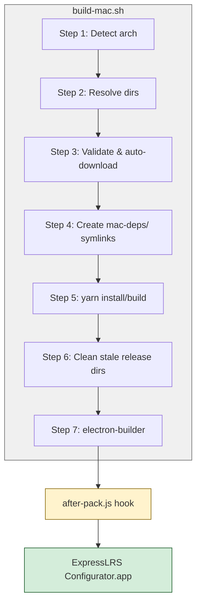

# macOS Build Flow (build-mac.sh)

Quick reference for building the ExpressLRS Configurator native app on macOS.

## Prerequisites

- macOS (Intel or Apple Silicon)
- Node.js and Yarn installed

## Usage

```bash
./build-mac.sh arm64         # Apple Silicon (M1/M2/M3/etc.)
./build-mac.sh x86_64        # Intel (x86)
./build-mac.sh -a            # auto-detect native architecture and build
./build-mac.sh -h            # show help message
```

> **Note:** Running the script with no arguments displays the help message. Use `-a` or `--auto` to build for the detected architecture.

## Build Flow Overview



## Detailed Steps

### Step 1: Architecture Detection

Determines the target architecture from a CLI argument or the `-a`/`--auto` flag. Without any arguments, the script displays a help message. With `-a`, it auto-detects via `uname -m`. Returns `"arm64"` on Apple Silicon and `"x86_64"` on Intel Macs. Common aliases are supported (`intel`, `aarch64`, `"apple-silicon"`).

### Step 2: Toolchain Directory Resolution

Maps the resolved architecture to its corresponding toolchain root and directory names. These variables feed into the symlink creation step below, allowing `package.json` to reference stable paths regardless of architecture.

### Step 3: Dependency Validation (arm64 only)

Checks whether `dependencies/darwin_arm64/portable-python-3.14.6` exists and is non-empty. If missing (e.g., fresh checkout, after cleanup), the build script automatically runs `dependencies/darwin_arm64/download-portable-python.sh` to download and prepare it. A defensive re-check verifies the directory exists after the download; if not, the build fails with a clear error message.

### Step 4: mac-deps/ Symlink Creation

Creates or refreshes the `mac-deps/` directory with symlinks pointing to the correct architecture-specific toolchain directories. These stable paths (`mac-deps/portable-python`, and `mac-deps/portable-git` on x64) are what `package.json` references in its `extraFiles` configuration.

**Why portable-git is in extraFiles for both architectures:** The `extraFiles` config in `package.json` lists both `portable-python` and `portable-git` unconditionally. On arm64, `build-mac.sh` creates an empty `mac-deps/portable-git` placeholder directory so electron-builder doesn't fail. The `after-pack.js` hook then removes this placeholder from the final `.app` — only `portable-python` ends up bundled.

### Step 5: yarn install/build

Conditionally runs `yarn install --frozen-lockfile` only if `node_modules/` is missing, then runs `yarn build` to compile the application.

### Step 6: Clean Stale Release Directories

Removes any stale `release/mac-${arch}` and `release/mac-${arch}.tmp` directories from a previous interrupted build. Without this cleanup, electron-builder can fail with `ENOTEMPTY`.

### Step 7: electron-builder Invocation

Delegates to `electron-builder --mac --${ARCH}` using `exec` so that Ctrl+C and other signals are forwarded directly (no orphaned processes).

## Architecture-Specific Behavior

| Feature | arm64 (Apple Silicon) | x86_64 (Intel) |
|---------|----------------------|----------------|
| Python | `portable-python-3.14.6` (bundled) | `python-portable-darwin-3.8.4` (bundled) |
| Git | System `/usr/bin/git` — **not bundled** | `git-2.29.2` (bundled) |

## The mac-deps/ Abstraction Layer

The `mac-deps/` directory provides a stable, architecture-independent interface between the build script and electron-builder. Without it, `package.json` would need arch-specific configuration or multiple build targets.

**How it works:**

1. **`build-mac.sh` creates symlinks at build time:**
   ```
   mac-deps/portable-python → ../dependencies/darwin_arm64/portable-python-3.14.6  (arm64)
   mac-deps/portable-python → ../dependencies/darwin_amd64/python-portable-darwin-3.8.4  (x64)
   mac-deps/portable-git    → ../dependencies/darwin_amd64/git-2.29.2              (x64 only)
   ```

2. **`package.json` references stable paths:**
   ```json
   { "from": "mac-deps/portable-python", "to": "dependencies/portable-python" }
   ```
   Electron-builder copies these symlinks into the `.app` at the runtime path `dependencies/portable-python`.

3. **`scripts/after-pack.js` renames to arch-specific names:**
   ```
   dependencies/portable-python  →  dependencies/portable-python-arm64  (or x64)
   dependencies/portable-git     →  dependencies/portable-git-x64       (x64 only)
   ```

The runtime code (`src/main/main.ts`) then discovers these arch-specific directories to set up the `PATH` environment variable.

## Directory Structure

```
dependencies/
├── darwin_arm64/                          # Apple Silicon toolchains
│   ├── download-portable-python.sh        # Auto-download script (see Step 3)
│   └── portable-python-3.14.6/            # Bundled into .app as port...-python-arm64
│       ├── bin/python                     # Standalone Python 3.14.6
│       ├── bin/pip                        # pip with pyserial + setuptools installed
│       └── (other Python runtime files)
│
├── darwin_amd64/                          # Intel toolchains
│   ├── git-2.29.2/                        # Bundled into .app as portable-git-x64
│   └── python-portable-darwin-3.8.4/      # Bundled into .app as port...-python-x64
│       ├── bin/python
│       └── (other Python runtime files)
│
├── windows_amd64/                         # Windows toolchains (not covered here)
│   ├── PortableGit/
│   └── python/
 │
└── get-platformio.py                      # PlatformIO installer (bundled into .app)

mac-deps/                                  # Created fresh by build-mac.sh (gitignored)
├── portable-python → ../dependencies/...  # Symlink (arch-specific at build time)
└── portable-git → ../dependencies/...     # Symlink (x64 only)
```

**Inside the built `.app`:**

```
ExpressLRS Configurator.app/
└── Contents/
    ├── dependencies/                      # electron-builder extraFiles go here
    │   ├── portable-python-arm64/         # Renamed by after-pack.js
    │   └── portable-python-x64/           # Renamed by after-pack.js
    │   ├── portable-git-x64/              # Only on x64 builds
    │  └── get-platformio.py              # Bundled from package.json extraFiles
```

## Troubleshooting

### Missing portable dependencies on arm64

**Error:** `Error: dependencies/darwin_arm64/portable-python-3.14.6 is still missing after running download script.`

**Fix:** The build script attempts to auto-download, but if it fails (network error, server unavailable), run the download script manually:
```bash
cd dependencies/darwin_arm64 && ./download-portable-python.sh
```

### Stale mac-deps/ directory

**Symptom:** The build fails with `portable-git not found` or similar, even though you just ran the build.

**Cause:** A previous architecture's `mac-deps/` directory may still exist as a real directory instead of symlinks.

**Fix:** `build-mac.sh` handles this automatically by running `rm -rf mac-deps || true` before creating fresh symlinks. No manual intervention needed — just re-run the build script with your target architecture:
```bash
./build-mac.sh arm64
```

### Building the wrong architecture

**Error:** `▶ Building for macOS x86_64` when you expected arm64 on Apple Silicon.

**Cause:** `uname -m` returns the native architecture, but you may be running under Rosetta 2 translation.

**Fix:** Explicitly specify the architecture:
```bash
# Force arm64 even if running under Rosetta
./build-mac.sh arm64

# Force x86_64 on Apple Silicon
./build-mac.sh x86_64

# Use auto-detection
./build-mac.sh -a
```

### Build failures from electron-builder

**Symptom:** Electron-builder exits with an error but no portable-toolchain-related messages.

**Fixes to try:**
1. Clear the build cache: `rm -rf release/`
2. Ensure Node.js and Yarn are installed and functional: `node --version && yarn --version`
3. Run a clean build from scratch: remove `mac-deps/`, then re-run `./build-mac.sh arm64` (or `x86_64`)
4. Check the full electron-builder log output for dependency or signing errors

### Manually rebuild portable-python (arm64)

To force a re-download of the arm64 Python toolchain:
```bash
rm -rf dependencies/darwin_arm64/portable-python-3.14.6
./build-mac.sh arm64
```

The build script will detect the missing directory and run `download-portable-python.sh` automatically. If you want to skip the build and only download:
```bash
cd dependencies/darwin_arm64 && ./download-portable-python.sh
```
